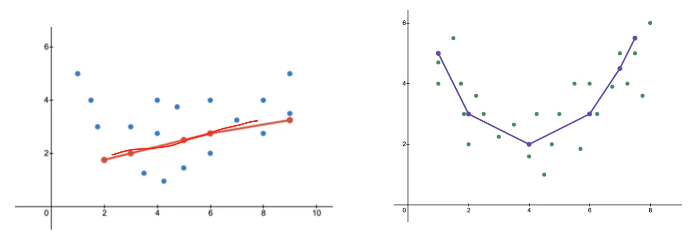
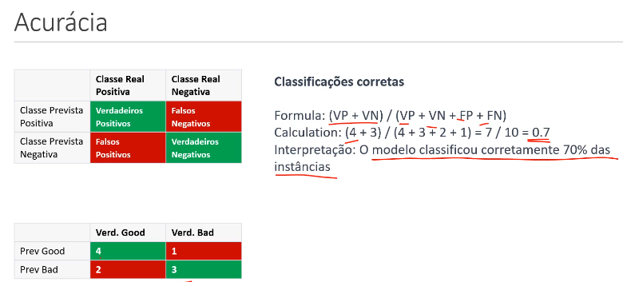

## Fundamentos de Machine Learning

O Machine Learning é a área mais importante do universo de IA e necessita de uma dedicação abrangente pois há uma complexidade alta para o domínio desta área.

- Machine Learning é o aprendizado de máquina, ou seja, o aprendizado requer uma capacidade de aprender sobre determinados assuntos de forma contínua e sempre tem alguma relação com o ambiente para esse aprendizado, seja por meio de brincadeiras, informações, etc.
Como uma máquina interage com o ambiente? Através de fontes de dados ou através de reforço (tentativa e erro).
O aprendizado deve ter evolução e deve ser mensurado através de métricas, para o uso do modelo.

## Como a máquina aprende?

Para o treinamento há uma fonte de dados e básicamente através da relação desses dados ocorrerá um processamento/algoritmo que através dele é possível obter resultados de deciões e essas decisões formam um modelo, como você pode ver abaixo.

CVocê quer prever em quais dias poderá jogar vôlei. Os dados de entrada podem conter informações como **clima**, **temperatura**, **umidade** e **vento**. O algoritmo processa esses dados e gera um modelo (como uma árvore de decisão). Esse modelo é capaz de fazer previsões para novos dias com base nos dados que ele já viu durante o treinamento.

O resultado do aprendizado é uma árvore de decisão, que seria o modelo.

Assim, vamos supor que surja um novo dia:

|Ensolarado|quente|alta|FALSO|
|----------|------|----|-----|

Como vou saber se poderei jogar? O modelo, ao receber esses novos dados, percorre a árvore de decisão para verificar as condições e, com base nas regras que ele aprendeu, irá decidir se você poderá jogar ou não.

## Conceitos de Machine Learning

Geralmente as estruturas dos dados em que os modelos irão trabalhar serão dados tabulados como no exemplo abaixo, mas eventualmente pode se referir a matrizes por exemplo e a resolução vem a partir de cálculos matemáticos.

### Conceitos importantes:

- **Atributos**: Características utilizadas para rotular os dados e a partir dessas características utilizamos as aplicações dos modelos em favor delas.
- **Instâncias**: Representação de algum fator, ou seja, nesse caso, uma tupla.
- **Classe**: Nos modelos que utilizam a técnica de classificação o objetivo é prever ou descrever um atributo especial (**classe**), ou seja ele é o objetivo do modelo de ML, ele se chama assim por convenção.
- **Tipos de dados**: Há muitas mudanças em relação aos tipos de dados que são **Dados Categóricos** e **Dados Numéricos**, e também há diferenciação entre atributos comuns ou em classes.

### Conceitos fundamentais:

Tarefas mais importantes: 

- **Classificação**: A classificação é uma técnica usada para prever ou descrever uma classe categórica (também chamada de rótulo). Isso significa que, dado um conjunto de características ou atributos (variáveis preditoras), o objetivo é prever a qual categoria (classe) a nova observação pertence.
    - **Exemplo**: Prever se um e-mail é spam ou não spam, diagnosticar uma doença, ou identificar a raça de um animal com base em suas características.
    - Os dados aqui são categóricos, ou seja, pertencem a categorias discretas (por exemplo, "fraude" ou "não fraude").

- **Regressão**: A regressão é usada para prever ou descrever um atributo numérico. Nesse caso, o objetivo é prever um valor contínuo com base em variáveis preditoras.
    - Exemplo: Prever o preço de uma casa com base em características como área, número de quartos, localização, etc.
    - Os dados de saída (classe) aqui são numéricos (por exemplo, o valor de uma casa).

- **Agrupamento**: O agrupamento é uma técnica que busca identificar grupos (ou clusters) de dados que compartilham características semelhantes. Ao contrário da classificação, o agrupamento não utiliza rótulos previamente conhecidos. O algoritmo tenta agrupar os dados com base em suas similaridades.
    - Exemplo: Agrupar clientes com comportamento de compra semelhante em um e-commerce para criar segmentos de marketing.
    - O objetivo é encontrar padrões e agrupamentos naturais nos dados, como novas espécies de animais ou diferentes grupos de consumidores.

- **Regra de Associação**: As regras de associação buscam descobrir padrões e relações entre os itens de um conjunto de dados, onde a presença de certos itens pode sugerir a ocorrência de outros.
    - Exemplo: No caso de um supermercado, se um cliente compra leite, também é provável que ele compre pão. As regras de associação são usadas em recomendações de produtos, cestas de compras, etc.
    - Essa técnica ajuda a prever quais itens ou ações tendem a ocorrer juntos com base em dados históricos.

- **Diferenças de técnicas**: 
    - **Aprendizado Supervisionado**: No aprendizado supervisionado, o algoritmo é treinado em um conjunto de dados que possui rótulos conhecidos. O objetivo é fazer com que o modelo aprenda a mapear as variáveis preditoras para o rótulo (classe) correto.
        - Exemplo: Um modelo que prevê se uma transação é fraude ou não, onde já existem transações rotuladas como fraude ou não-fraude para treinamento.
        - Avaliamos a performance do modelo comparando as previsões com os rótulos reais.

    - **Aprendizado Não Supervisionado**: No aprendizado não supervisionado, o algoritmo não tem rótulos pré-definidos. O objetivo é descobrir padrões nos dados sem uma classe ou valor alvo.
        - Exemplo: Um algoritmo de agrupamento (clustering) que organiza os dados em grupos com características semelhantes, sem ter rótulos pré-definidos para os grupos.
        - Não há uma base de comparação direta para avaliar o desempenho, já que os rótulos não existem.

## Técnicas:

### Classificação: 
A classificação é usada para prever ou descrever um rótulo baseado em dados categóricos. O algoritmo utiliza um atributo especial como a classe (o alvo a ser previsto). As classes são discretas, e o objetivo do modelo é atribuir novos dados a uma das classes.

**Exemplo**: Prever se um cliente irá comprar ou não um produto com base em seu histórico de compras.

Um exemplo utilizando a técnica de classificação, seria esse abaixo com um modelo simples, para classificar a probabilidade de um email ser ou não ser spam:

Como nós medimos o desempenho do modelo? Os modelos necessitam de métricas para medições pois são desenvolvidos por diferentes parametrizações e diferentes técnicas de algoritmos, naturalmente algum mais eficaz que outros para determinados contextos.

Nós iremos dividir os dados em dois ou três subconjuntos, treinando o modelo com alguns dados específicos e validando com outros de mesma característica:
- **Conjunto de Dados de Treino**: Parte dos dados designada para a criação do modelo.
- **Conjunto de Dados de Validação**: Dados que serão necessários para ajustar ou melhorar o modelo já desenvolvido pelo conjunto de dados de treino.
- **Conjunto de Dados de Teste**: Conjunto de dados utilizado para melhorar a performance do modelo já desenvolvido e parcialmente validado.

Existem algumas técnicas de separação dos dados para realização de treino e de teste, como mostra na figura a seguir:

Técnica do **Hold-Out** os dados são divididos em treino e teste, sendo para treino os dados históricos e com uma proporção maior. 
Para teste, o restante dos dados históricos para mapear e ter uma boa consolidação do modelo. A partir desses dados de teste, o modelo fará uma nova predição, pode ser que seja a mesma ou uma diferente, e aí obteremos a avaliação de desempenho do modelo desenvolvido. Pode haver erros durante a avaliação de desempenho obviamente, por isso a previsão é feita antes de utilizar essa avaliação.

**Validação Cruzada** utilizando essa ténica, cada registro é usado n vezes para treinamento e uma única vez para testes.
Se eu tenho 10 subconjuntos, 9 seria para treino e outro para teste, assim o que é de treino vai para teste e o que é de teste vai para treino.

#### Generalização X Super Ajuste X Sub Ajuste

O objetivo ao criar um modelo de aprendizado de máquina é alcançar um **modelo genérico**, ou seja, um modelo que tenha **performance semelhante** tanto em um ambiente de desenvolvimento (durante os testes com os dados de treino) quanto em um ambiente de produção (quando for aplicado em dados reais que o modelo nunca viu).

- **Generalização**: A **generalização** ocorre quando o modelo consegue aprender os padrões presentes nos dados de treinamento e aplicá-los corretamente em novos dados, mantendo um bom desempenho em ambos os ambientes (teste e produção). Um modelo bem generalizado é robusto e consistente
 

- **Super Ajuste (Overfitting)**: O super ajuste acontece quando o modelo se torna **altamente especializado** nos dados de treino, capturando até mesmo os ruídos ou peculiaridades específicas desses dados. Isso faz com que o modelo tenha um desempenho excelente nos dados de treino, mas quando é testado com novos dados (em produção), ele apresenta um desempenho ruim, já que não consegue se adaptar às variações dos novos dados.
Causas do super ajuste:
    - Tamanho insificiente do conjunto de dados.
    - Complexidade excessiva do modelo de treinamento (os simples trazem os melhores resultados, algoritmos, modelos).
    - Ruído nos dados de treinamento (valores incorreto, erros na medição).
    - Seleção inadequada de atributos (excesso).
    - Falta da validação cruzada (divisão dos dados).
    Na imagem abaixo, a linha preta demonstra um exemplo de **generalização**, onde o modelo tem um desempenho consistente tanto nos dados de treino quanto nos dados de produção. Já a linha verde ilustra um exemplo de **super ajuste (overfitting)**, onde o modelo se ajusta muito bem aos dados de treino, mas não consegue manter a mesma performance com novos dados.

- **Sub Ajuste (Underfitting)**: O sub ajuste acontece quando um modelo tem dificuldade em captar os padrões dos dados, tanto durante o treinamento quanto na aplicação em novos dados. Isso significa que o modelo é incapaz de aprender adequadamente, resultando em um desempenho ruim tanto nos dados de treino quanto nos dados de teste. O sub ajuste ocorre quando o modelo não é complexo o suficiente para capturar as relações subjacentes nos dados.
Causas do sub ajuste:
    - Modelo muito simples: Um modelo simples pode não ter a capacidade de capturar padrões complexos presentes nos dados. Por exemplo, utilizar uma regressão linear para dados que exigem uma curva mais complexa resultaria em sub ajuste.
    - Conjunto de dados muito pequeno: Com um conjunto de dados pequeno, o modelo não consegue observar uma amostra ampla o suficiente dos padrões. Isso faz com que ele tenha dificuldade em aprender adequadamente, já que não tem exemplos suficientes para captar a complexidade dos dados.
    - Seleção inadequada de atributos: Se os atributos (features) escolhidos para o modelo não forem relevantes ou não capturarem as informações essenciais dos dados, o modelo terá dificuldade em fazer previsões precisas. A seleção de atributos é crucial para o desempenho do modelo.
    - Falta de ajuste de hiperparâmetros: Os hiperparâmetros são configurações que controlam como o modelo aprende. A escolha inadequada de hiperparâmetros (por exemplo, taxa de aprendizado muito alta ou baixa, profundidade da árvore de decisão muito rasa, etc.) pode fazer com que o modelo não seja capaz de aprender adequadamente, resultando em sub ajuste.

## Exemplos de métricas utilizadas para medir os modelos 

**Acuráricia**: A acurácia é uma métrica simples e direta, usada para medir o desempenho de um modelo de classificação. Ela representa a **proporção de previsões corretas** feitas pelo modelo em relação ao total de previsões. Ou seja, a acurácia indica o percentual de instâncias que foram corretamente classificadas.

Ela é calculada pela fórmula:

\[
\text{Acurácia} = \frac{\text{Previsões Corretas}}{\text{Total de Previsões}} = \frac{VP + VN}{VP + VN + FP + FN}
\]

Onde:
- **VP (Verdadeiros Positivos)**: Instâncias corretamente classificadas como positivas.
- **VN (Verdadeiros Negativos)**: Instâncias corretamente classificadas como negativas.
- **FP (Falsos Positivos)**: Instâncias incorretamente classificadas como positivas.
- **FN (Falsos Negativos)**: Instâncias incorretamente classificadas como negativas.

### Exemplo prático:
Se você está construindo um modelo para classificar se um e-mail é **spam** ou **não spam**, a acurácia seria a porcentagem de e-mails corretamente classificados (tanto os que são spam quanto os que não são).

- Se seu modelo classificou 100 e-mails, e 90 foram classificados corretamente, sua acurácia será:
  \[
  \text{Acurácia} = \frac{90}{100} = 90\%
  \]

### Limitações:
Embora a acurácia seja uma métrica importante, ela pode ser **enganosa em conjuntos de dados desbalanceados**. Por exemplo, se 95% dos e-mails em um dataset não forem spam, um modelo que classifique todos os e-mails como "não spam" teria uma alta acurácia (95%), mas seria ineficiente para detectar e-mails de spam.

Por isso, é recomendável utilizar a acurácia em conjunto com outras métricas, como **precisão**, **recall** e **F1-score**, especialmente em situações de classes desbalanceadas.

## Métricas de erros para regressão

Quando estamos lidando com **modelos de regressão**, o objetivo é prever um **valor numérico** em vez de uma classe categórica. Avaliar o desempenho desses modelos exige o uso de **métricas de erros específicas para regressão**, que comparam as previsões numéricas geradas pelo modelo com os valores reais esperados.

Essas métricas de erro medem a diferença entre os valores previstos e os reais, fornecendo insights sobre a precisão do modelo e identificando áreas em que ele pode estar cometendo erros. Essas métricas são aplicáveis a uma variedade de cenários, como:

- **Regressão Clássica**: Modelos tradicionais de regressão linear, polinomial, etc.
- **Regressão em Machine Learning**: Modelos mais complexos, como regressão por árvores de decisão, redes neurais, entre outros.
- **Séries Temporais**: Modelos que fazem previsões ao longo do tempo, onde é importante prever valores contínuos, como preços de ações, previsões de demanda, etc.

### Principais métricas de erro para regressão:

1. **Mean Absolute Error (MAE)** – Erro Absoluto Médio:
   - O **MAE** calcula a média dos valores absolutos das diferenças entre as previsões e os valores reais. Em outras palavras, ele mostra o quanto, em média, o valor previsto está distante do valor real.
   - Fórmula: 
     \[
     MAE = \frac{1}{n} \sum_{i=1}^{n} |y_i - \hat{y}_i|
     \]
     Onde:
     - \(y_i\) são os valores reais.
     - \(\hat{y}_i\) são os valores previstos.
     - \(n\) é o número de amostras.
   - **Vantagem**: É fácil de interpretar e não é muito sensível a outliers, já que apenas calcula a magnitude do erro sem considerá-lo quadrado.
   - **Desvantagem**: Não diferencia grandes e pequenos erros.

2. **Mean Squared Error (MSE)** – Erro Quadrático Médio:
   - O **MSE** calcula a média dos quadrados das diferenças entre os valores reais e previstos. Diferente do MAE, ele penaliza erros maiores de forma mais significativa, uma vez que os erros são elevados ao quadrado.
   - Fórmula: 
     \[
     MSE = \frac{1}{n} \sum_{i=1}^{n} (y_i - \hat{y}_i)^2
     \]
   - **Vantagem**: Penaliza grandes erros de forma mais severa, sendo útil quando erros grandes são indesejáveis.
   - **Desvantagem**: Por elevar ao quadrado, pode exagerar a influência de outliers no erro total.

3. **Root Mean Squared Error (RMSE)** – Raiz do Erro Quadrático Médio:
   - O **RMSE** é a raiz quadrada do **MSE**. Ele traz o erro para a mesma escala dos valores reais, o que facilita a interpretação, especialmente quando os valores previstos são de uma escala grande.
   - Fórmula: 
     \[
     RMSE = \sqrt{\frac{1}{n} \sum_{i=1}^{n} (y_i - \hat{y}_i)^2}
     \]
   - **Vantagem**: Fornece um valor mais interpretável por estar na mesma unidade dos dados originais.
   - **Desvantagem**: Assim como o MSE, é sensível a outliers.

4. **R² (Coeficiente de Determinação)**:
   - O **R²** mede a proporção da variação nos valores reais que é explicada pelas previsões do modelo. Ele varia de 0 a 1, onde 1 significa que o modelo explica toda a variabilidade dos dados, e 0 significa que ele não explica nada.
   - Fórmula: 
     \[
     R^2 = 1 - \frac{\sum (y_i - \hat{y}_i)^2}{\sum (y_i - \bar{y})^2}
     \]
     Onde \(\bar{y}\) é a média dos valores reais.
   - **Vantagem**: Fornece uma boa visão geral da qualidade do ajuste do modelo.
   - **Desvantagem**: Pode ser enganoso em modelos com muitos parâmetros ou com dados desbalanceados.

5. **Mean Absolute Percentage Error (MAPE)** – Erro Absoluto Percentual Médio:
   - O **MAPE** calcula o erro absoluto como uma porcentagem do valor real. Ele mostra o erro em termos percentuais, facilitando a comparação entre diferentes conjuntos de dados ou escalas.
   - Fórmula: 
     \[
     MAPE = \frac{1}{n} \sum_{i=1}^{n} \left| \frac{y_i - \hat{y}_i}{y_i} \right| \times 100
     \]
   - **Vantagem**: Fornece uma métrica de erro relativa, útil para comparação entre conjuntos de dados de diferentes escalas.
   - **Desvantagem**: Não funciona bem quando há valores próximos de zero, pois gera valores muito altos ou indefinidos.

---

### Aplicações das métricas:

1. **Regressão Clássica**:
   - Ao usar modelos tradicionais, como a **Regressão Linear**, **MSE** e **R²** são comumente usados para avaliar o ajuste do modelo aos dados.
   - **MAE** é útil quando se deseja avaliar o erro médio absoluto em unidades reais.
  
2. **Regressão em Machine Learning**:
   - Em **modelos de Machine Learning**, como árvores de decisão, redes neurais, ou regressão polinomial, o **RMSE** é muitas vezes utilizado, pois facilita a comparação dos erros em termos da escala dos dados.
   - **R²** é frequentemente usado para comparar a explicabilidade dos diferentes modelos.

3. **Séries Temporais**:
   - Em **previsões de séries temporais**, métricas como **MAPE** são preferidas, pois permitem interpretar o erro em termos percentuais. Isso ajuda a entender o desempenho em diferentes escalas temporais.
   - O **RMSE** também é usado, especialmente quando se trata de prever valores contínuos como vendas, temperatura ou estoque.

---