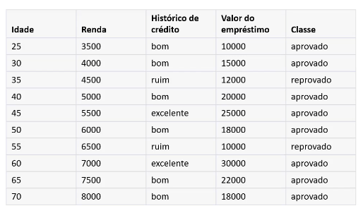
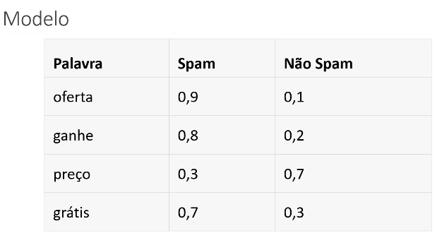
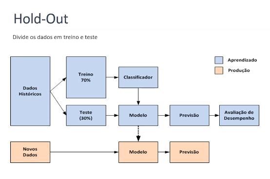

## Fundamentos de Machine Learning

O Machine Learning é a área mais importante do universo de IA e necessita de uma dedicação abrangente pois há uma complexidade alta para o domínio desta área.

- Machine Learning é o aprendizado de máquina, ou seja, o aprendizado requer uma capacidade de aprender sobre determinados assuntos de forma contínua e sempre tem alguma relação com o ambiente para esse aprendizado, seja por meio de brincadeiras, informações, etc.
Como uma máquina interage com o ambiente? Através de fontes de dados ou através de reforço (tentativa e erro).
O aprendizado deve ter evolução e deve ser mensurado através de métricas, para o uso do modelo.

## Como a máquina aprende?

Para o treinamento há uma fonte de dados e básicamente através da relação desses dados ocorrerá um processamento/algoritmo que através dele é possível obter resultados de deciões e essas decisões formam um modelo, como você pode ver abaixo.

CVocê quer prever em quais dias poderá jogar vôlei. Os dados de entrada podem conter informações como **clima**, **temperatura**, **umidade** e **vento**. O algoritmo processa esses dados e gera um modelo (como uma árvore de decisão). Esse modelo é capaz de fazer previsões para novos dias com base nos dados que ele já viu durante o treinamento.

O resultado do aprendizado é uma árvore de decisão, que seria o modelo.

Assim, vamos supor que surja um novo dia:

|Ensolarado|quente|alta|FALSO|
|----------|------|----|-----|

Como vou saber se poderei jogar? O modelo, ao receber esses novos dados, percorre a árvore de decisão para verificar as condições e, com base nas regras que ele aprendeu, irá decidir se você poderá jogar ou não.

## Conceitos de Machine Learning

Geralmente as estruturas dos dados em que os modelos irão trabalhar serão dados tabulados como no exemplo abaixo, mas eventualmente pode se referir a matrizes por exemplo e a resolução vem a partir de cálculos matemáticos.

### Conceitos importantes:

- **Atributos**: Características utilizadas para rotular os dados e a partir dessas características utilizamos as aplicações dos modelos em favor delas.
- **Instâncias**: Representação de algum fator, ou seja, nesse caso, uma tupla.
- **Classe**: Nos modelos que utilizam a técnica de classificação o objetivo é prever ou descrever um atributo especial (**classe**), ou seja ele é o objetivo do modelo de ML, ele se chama assim por convenção.
- **Tipos de dados**: Há muitas mudanças em relação aos tipos de dados que são **Dados Categóricos** e **Dados Numéricos**, e também há diferenciação entre atributos comuns ou em classes.

### Conceitos fundamentais:

Tarefas mais importantes: 

- **Classificação**: A classificação é uma técnica usada para prever ou descrever uma classe categórica (também chamada de rótulo). Isso significa que, dado um conjunto de características ou atributos (variáveis preditoras), o objetivo é prever a qual categoria (classe) a nova observação pertence.
    - **Exemplo**: Prever se um e-mail é spam ou não spam, diagnosticar uma doença, ou identificar a raça de um animal com base em suas características.
    - Os dados aqui são categóricos, ou seja, pertencem a categorias discretas (por exemplo, "fraude" ou "não fraude").

- **Regressão**: A regressão é usada para prever ou descrever um atributo numérico. Nesse caso, o objetivo é prever um valor contínuo com base em variáveis preditoras.
    - Exemplo: Prever o preço de uma casa com base em características como área, número de quartos, localização, etc.
    - Os dados de saída (classe) aqui são numéricos (por exemplo, o valor de uma casa).

- **Agrupamento**: O agrupamento é uma técnica que busca identificar grupos (ou clusters) de dados que compartilham características semelhantes. Ao contrário da classificação, o agrupamento não utiliza rótulos previamente conhecidos. O algoritmo tenta agrupar os dados com base em suas similaridades.
    - Exemplo: Agrupar clientes com comportamento de compra semelhante em um e-commerce para criar segmentos de marketing.
    - O objetivo é encontrar padrões e agrupamentos naturais nos dados, como novas espécies de animais ou diferentes grupos de consumidores.

- **Regra de Associação**: As regras de associação buscam descobrir padrões e relações entre os itens de um conjunto de dados, onde a presença de certos itens pode sugerir a ocorrência de outros.
    - Exemplo: No caso de um supermercado, se um cliente compra leite, também é provável que ele compre pão. As regras de associação são usadas em recomendações de produtos, cestas de compras, etc.
    - Essa técnica ajuda a prever quais itens ou ações tendem a ocorrer juntos com base em dados históricos.

- **Diferenças de técnicas**: 
    - **Aprendizado Supervisionado**: No aprendizado supervisionado, o algoritmo é treinado em um conjunto de dados que possui rótulos conhecidos. O objetivo é fazer com que o modelo aprenda a mapear as variáveis preditoras para o rótulo (classe) correto.
        - Exemplo: Um modelo que prevê se uma transação é fraude ou não, onde já existem transações rotuladas como fraude ou não-fraude para treinamento.
        - Avaliamos a performance do modelo comparando as previsões com os rótulos reais.

    - **Aprendizado Não Supervisionado**: No aprendizado não supervisionado, o algoritmo não tem rótulos pré-definidos. O objetivo é descobrir padrões nos dados sem uma classe ou valor alvo.
        - Exemplo: Um algoritmo de agrupamento (clustering) que organiza os dados em grupos com características semelhantes, sem ter rótulos pré-definidos para os grupos.
        - Não há uma base de comparação direta para avaliar o desempenho, já que os rótulos não existem.

## Técnicas:

### Classificação: 
A classificação é usada para prever ou descrever um rótulo baseado em dados categóricos. O algoritmo utiliza um atributo especial como a classe (o alvo a ser previsto). As classes são discretas, e o objetivo do modelo é atribuir novos dados a uma das classes.

**Exemplo**: Prever se um cliente irá comprar ou não um produto com base em seu histórico de compras.

Um exemplo utilizando a técnica de classificação, seria esse abaixo com um modelo simples, para classificar a probabilidade de um email ser ou não ser spam:

Como nós medimos o desempenho do modelo? Os modelos necessitam de métricas para medições pois são desenvolvidos por diferentes parametrizações e diferentes técnicas de algoritmos, naturalmente algum mais eficaz que outros para determinados contextos.

Nós iremos dividir os dados em dois ou três subconjuntos, treinando o modelo com alguns dados específicos e validando com outros de mesma característica:
- **Conjunto de Dados de Treino**: Parte dos dados designada para a criação do modelo.
- **Conjunto de Dados de Validação**: Dados que serão necessários para ajustar ou melhorar o modelo já desenvolvido pelo conjunto de dados de treino.
- **Conjunto de Dados de Teste**: Conjunto de dados utilizado para melhorar a performance do modelo já desenvolvido e parcialmente validado.

Existem algumas técnicas de separação dos dados para realização de treino e de teste, como mostra na figura a seguir:

Técnica do **Hold-Out** os dados são divididos em treino e teste, sendo para treino os dados históricos e com uma proporção maior. 
Para teste, o restante dos dados históricos para mapear e ter uma boa consolidação do modelo. A partir desses dados de teste, o modelo fará uma nova predição, pode ser que seja a mesma ou uma diferente, e aí obteremos a avaliação de desempenho do modelo desenvolvido. Pode haver erros durante a avaliação de desempenho obviamente, por isso a previsão é feita antes de utilizar essa avaliação.

**Validação Cruzada** utilizando essa ténica, cada registro é usado n vezes para treinamento e uma única vez para testes.
Se eu tenho 10 subconjuntos, 9 seria para treino e outro para teste, assim o que é de treino vai para teste e o que é de teste vai para treino.

#### Generalização X Super Ajuste X Sub Ajuste

O objetivo ao criar um modelo de aprendizado de máquina é alcançar um **modelo genérico**, ou seja, um modelo que tenha **performance semelhante** tanto em um ambiente de desenvolvimento (durante os testes com os dados de treino) quanto em um ambiente de produção (quando for aplicado em dados reais que o modelo nunca viu).

- **Generalização**: A **generalização** ocorre quando o modelo consegue aprender os padrões presentes nos dados de treinamento e aplicá-los corretamente em novos dados, mantendo um bom desempenho em ambos os ambientes (teste e produção). Um modelo bem generalizado é robusto e consistente
 

- **Super Ajuste (Overfitting)**: O super ajuste acontece quando o modelo se torna **altamente especializado** nos dados de treino, capturando até mesmo os ruídos ou peculiaridades específicas desses dados. Isso faz com que o modelo tenha um desempenho excelente nos dados de treino, mas quando é testado com novos dados (em produção), ele apresenta um desempenho ruim, já que não consegue se adaptar às variações dos novos dados.
Causas do super ajuste:
    - Tamanho insificiente do conjunto de dados.
    - Complexidade excessiva do modelo de treinamento (os simples trazem os melhores resultados, algoritmos, modelos).
    - Ruído nos dados de treinamento (valores incorreto, erros na medição).
    - Seleção inadequada de atributos (excesso).
    - Falta da validação cruzada (divisão dos dados).
    Na imagem abaixo, a linha preta demonstra um exemplo de **generalização**, onde o modelo tem um desempenho consistente tanto nos dados de treino quanto nos dados de produção. Já a linha verde ilustra um exemplo de **super ajuste (overfitting)**, onde o modelo se ajusta muito bem aos dados de treino, mas não consegue manter a mesma performance com novos dados.

